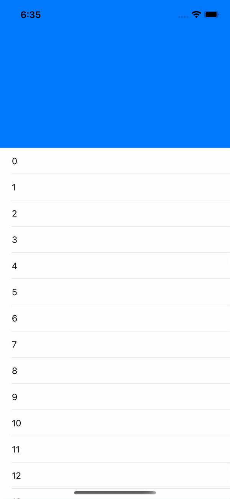
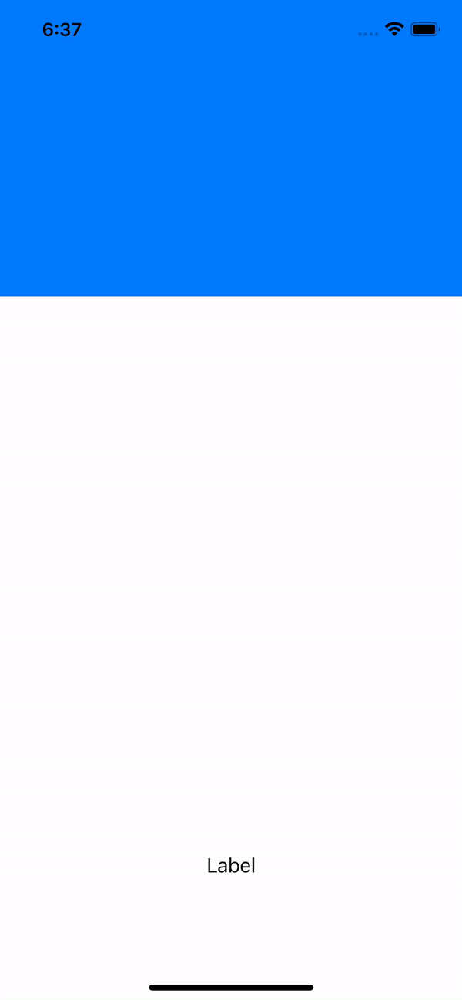
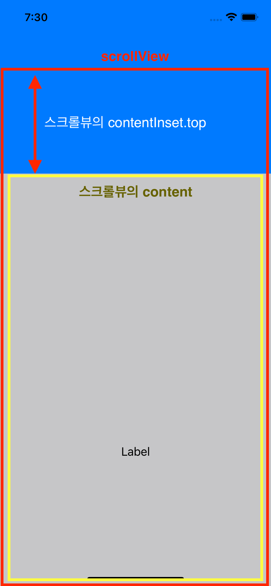
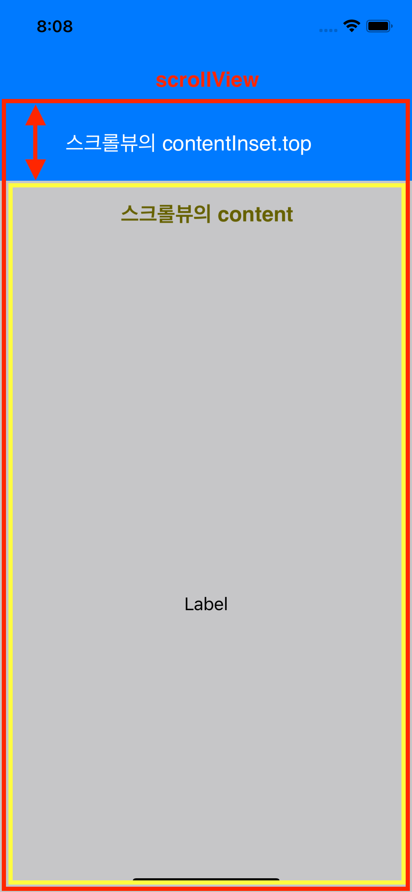
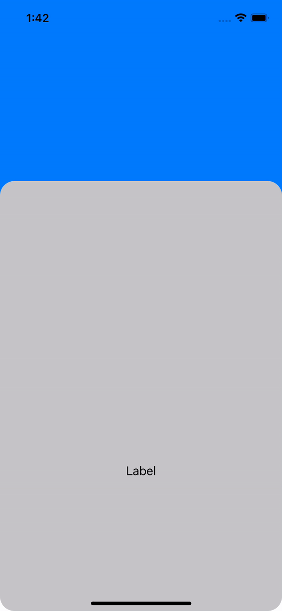

# Collapse-Header-iOS

스크롤한 정도에 따라 헤더가 접히거나 펼쳐지는 레이아웃   

## Collapse Header 1

헤더의 bottom과 scrollView의 top이 제약조건으로 서로 붙어있기 때문에 스크롤은 스크롤뷰에서만 가능하다.  
헤더에서 드래그를 시작하면 아무 일도 일어나지 않는다.

 

## Collapse Header 2

scrollView가 헤더를 가리면서 Superview.top에 붙어있고 scrollView에 contentInset을 줬기 때문에 스크롤뷰의 뒤에 있는 헤더가 보인다.

  
   

 

## Collapse Header 3

스크롤한 정도에 따라 타이틀이 사라졌다가 나타난다.

